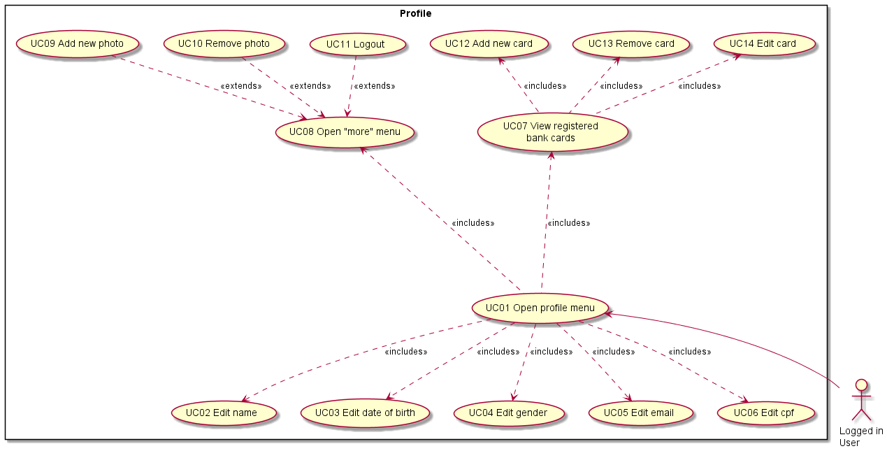

# Diagram 02 - Profile

## Description

After opening the app, the user can schedule appointments as he wishes through the main/home page.

## 1. Pre-conditions

> That is, what conditions must be attended beforehand so that the main actor can accomplish its tasks/use cases.

- User has app installed
- User opens app, and lands on Home page
- User must have internet connection

## 2. Flows

### 2.1 Main flow

1. User [opens home page <uc01>](#UC01---Open-Home-Menu).
2. User opts to [select closest date automatically <uc02>](#)
3. System makes query in database finding closest date
4. User [confirms he'll be able to attend at that date <uc03>](#)
5. User [select type of appointment he wants to schedule](#)
    possible options being:
    - [Online consultation <uc08>](#)
    - [Presential consultation <uc09>](#)
6. System [adds item to shopcart <uc10>](#).
7. System asks if user would like to:
    a. schedule more appointments
    b. continue to see shopcart
8. User verifies that shopcart is consistent to what he wants
9. User finishes it's purchase, [checking out <uc16>](#).

### 2.2 Alternative flows

#### 2.2.1 xxx

#### 2.2.2 yyy

### 2.3 Exception flows

#### 2.3.1 aaa

#### 2.3.1 bbb

## 3. Use cases

### UC01 - Open Home Menu

Expandir ⤵️

#### Basic flow of events

1. 
2. 

### UC02 - Select Closest Date Automatically

Expandir ⤵️

#### Basic flow of events

1. 
2. 

### UC03 - Confirm Using Automatically Chosen Date

Expandir ⤵️

#### Basic flow of events

1. 
2. 

### UC04 - Search In Calendar

Expandir ⤵️

#### Basic flow of events

1. 
2. 

### UC05 - Choose Preferred Date

Expandir ⤵️

#### Basic flow of events

1. 
2. 

### UC06 - Choose Preferred Hour

Expandir ⤵️

#### Basic flow of events

1. 
2. 

### UC07 - Select Type Of Appointment

Expandir ⤵️

#### Basic flow of events

1. 
2. 

### UC08 - Online Consultation

Expandir ⤵️

#### Basic flow of events

1. 
2. 

### UC09 - Presential Consultation

Expandir ⤵️

#### Basic flow of events

1. 
2. 

### UC10 - Help

Expandir ⤵️

#### Basic flow of events

1. 
2. 

### UC11 - Add Item To Cart

Expandir ⤵️

#### Basic flow of events

1. 
2. 

### UC12 - Shopping Cart

Expandir ⤵️

#### Basic flow of events

1. 
2. 

### UC13 - Change Credit Card

Expandir ⤵️

#### Basic flow of events

1. 
2. 

### UC14 - Add New Credit Card

Expandir ⤵️

#### Basic flow of events

1. 
2. 

### UC15 - Select Other Credit Card

Expandir ⤵️

#### Basic flow of events

1. 
2. 

### UC16 - Check Out

Expandir ⤵️

#### Basic flow of events

1. 
2. 

## 4. Post-conditions

| On success | On fail |
| ---------- | ------- |
| System set user schedules as unavailables (for other users) | *System maintain items in shopcart|
| System updates user list of appointments | System doesnt debt user |
| System informs user that everything worked out properly | System informs user of what errors possibly occurred |

'*' = maybe